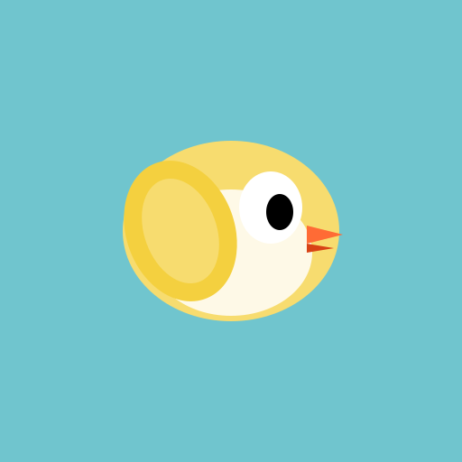

# Flappy Bird Clone 🐦

A modern recreation of the classic Flappy Bird game built with Next.js, TypeScript, and Tailwind CSS. Features enhanced gameplay mechanics, power-ups, achievements, and a progressive difficulty system.



## 🎮 Features

### Core Gameplay
- **Classic Mechanics**: Tap/click to flap, navigate through pipes
- **Smooth Physics**: Realistic gravity and collision detection
- **Responsive Design**: Playable on desktop and mobile devices
- **High Score Tracking**: Persistent local storage for best scores

### Enhanced Features
- **Power-Ups**: 
  - 🛡️ Shield (invincibility)
  - ⏱️ Slow-Mo (time dilation)
  - 🐤 Tiny Bird (smaller hitbox)
  - 🧲 Magnet (auto-collect points)
- **Achievement System**: 8 unlockable achievements
- **Day/Night Cycle**: Dynamic background changes
- **Difficulty Progression**: Game gets harder as you score more
- **Particle Effects**: Feathers, explosions, and sparkles
- **Sound & Music**: Procedurally generated audio

### Technical Features
- **Performance Monitoring**: Built-in FPS counter and diagnostics
- **Debug Mode**: God mode and auto-play for testing
- **PWA Support**: Installable as a mobile app
- **SEO Optimized**: Full metadata for social sharing

## 🚀 Getting Started

### Prerequisites
- Node.js 18.x or later
- npm or yarn

### Installation

1. Clone the repository:
```bash
git clone https://github.com/yourusername/flappy-bird-clone.git
cd flappy-bird-clone
```

2. Install dependencies:
```bash
npm install
```

3. Run the development server:
```bash
npm run dev
```

4. Open [http://localhost:3000](http://localhost:3000) in your browser

### Building for Production

```bash
npm run build
```

The build output will be in the `out` directory, ready for static hosting.

## 🎯 How to Play

1. **Start**: Click or tap to begin
2. **Flap**: Click/tap/spacebar to make the bird fly
3. **Score**: Pass through pipes to earn points
4. **Power-Ups**: Collect floating power-ups for temporary abilities
5. **Achievements**: Unlock achievements by completing challenges

### Controls
- **Desktop**: Click or press Spacebar
- **Mobile**: Tap anywhere on the screen
- **Debug Mode**: Press 'D' to toggle debug panel

## 🏆 Scoring System

- **Bronze Medal**: 10+ points
- **Silver Medal**: 20+ points  
- **Platinum Medal**: 30+ points
- **Gold Medal**: 40+ points

## 🛠️ Development

### Project Structure
```
flappy-bird-game/
├── app/                    # Next.js app directory
├── components/game/        # Game components
├── lib/                    # Utilities and game logic
├── public/                 # Static assets
├── scripts/               # Build scripts
└── types/                 # TypeScript definitions
```

### Key Technologies
- **Framework**: Next.js 14 (App Router)
- **Language**: TypeScript
- **Styling**: Tailwind CSS
- **Animation**: requestAnimationFrame
- **Audio**: Web Audio API
- **State**: React hooks (useRef, useState)

### Performance Optimizations
- Object pooling for particles
- Render batching
- Lazy loading
- Static export for CDN hosting

## 📱 PWA Installation

The game can be installed as a Progressive Web App:

1. Visit the game in a supported browser
2. Look for the install prompt or use browser menu
3. Add to home screen
4. Play offline!

## 🚀 Deployment

### Vercel (Recommended)

1. Push to GitHub
2. Import project in Vercel
3. Deploy with default settings

### Static Hosting

1. Build the project: `npm run build`
2. Upload the `out` directory to any static host
3. Configure server for SPA routing if needed

## 🐛 Debug Features

Press 'D' during gameplay to access:
- FPS counter
- Collision boxes visualization  
- God mode toggle
- Auto-play AI
- Performance metrics

## 📄 License

This project is open source and available under the MIT License.

## 🙏 Acknowledgments

- Original Flappy Bird by Dong Nguyen
- Built with Next.js and React
- Font: Press Start 2P from Google Fonts

## 🤝 Contributing

Contributions are welcome! Please feel free to submit a Pull Request.

---

Made with ❤️ by Claude AI
