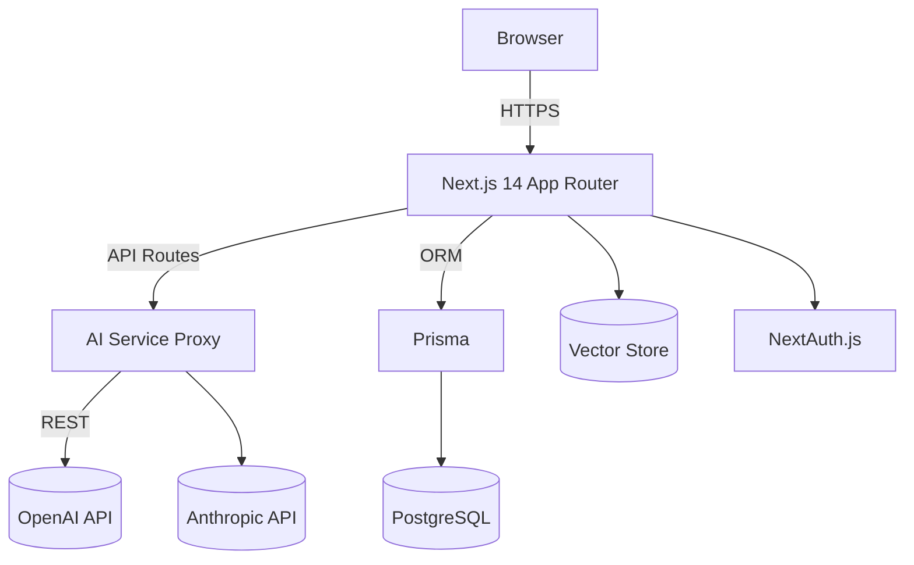

# System Patterns & Architecture

## High-Level Architecture

- **Client (React)**: Living within Next.js App Router pages, responsible for chat UI, dashboard, and settings. Utilises React Context/Zustand for state.
- **API Routes / Edge Functions**: Provide server-side logic for prompt orchestration, rate limiting, and interaction with external AI providers.
- **Database Layer**: Prisma as ORM interfacing with PostgreSQL for persistent user data, sessions, and metadata.
- **Vector Store**: Embeddings stored in a dedicated table or external service (e.g., Supabase Vector, Pinecone) for semantic search.
- **LLM Proxy**: Thin abstraction isolating vendor-specific details and enabling provider switching/fallback.

## Key Design Patterns
1. **Repository Pattern** – Encapsulate DB queries for users, sessions, knowledge documents.
2. **Factory Pattern** – Produce prompt templates and AI service instances based on model selection.
3. **Strategy Pattern** – Swap between OpenAI and Anthropic backends transparently.
4. **Context Provider** – Share global states (user, theme, settings) in React tree.
5. **Event Sourcing** – Store chronological research actions for replay/audit.
6. **CQRS (Read/Write Separation)** – Separate write-heavy chat interactions from read-heavy analytics.

## Component Relationships
- Chat components subscribe to `MessageStore` (Zustand).
- API responses are streamed via Server-Sent Events to the client for incremental rendering.
- Upload pipeline triggers embedding jobs that enqueue vector inserts.

## Technical Decisions
- Next.js 14 App Router chosen for SSR, API co-location, and Edge support.
- Tailwind + Shadcn/ui for rapid and consistent UI development.
- Prisma ORM to leverage type-safe DB access and migrations.
- NextAuth.js for flexible authentication providers.
- Jest & React Testing Library standardised for unit and integration tests.
- Vercel deployment pipeline for preview URLs on every PR.

## Non-Functional Requirements
- **Performance**: <200 ms p95 server response for cached vector searches.
- **Scalability**: Stateless API routes with horizontal scaling; database connection pooling.
- **Security**: Rate limiting middleware, prepared statements, OAuth scopes, and encrypted secrets.
- **Observability**: Logging, tracing, and metrics via Vercel Analytics and external APM. 